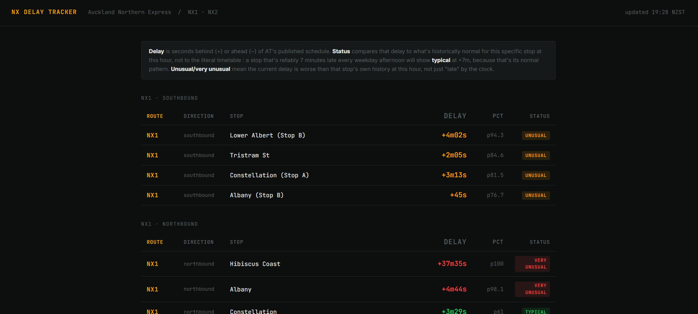

# Auckland Transit Delay Tracker

Tracks delay patterns on Auckland's Northern Express (NX1/NX2) bus
services using AT's realtime GTFS feed, builds statistical baselines
per stop per time-of-day bucket, and flags when current conditions
deviate from what's historically normal for that stop at that hour.

Live dashboard: [transit-anomaly-engine.onrender.com](https://transit-anomaly-engine.onrender.com)



## What it found

The most consistent pattern is on NX1 northbound during afternoon
peak. Several busway stations show median delays of 5-8 minutes every
weekday afternoon, with tight enough IQRs that this is a structural pattern:

| Stop          | 4-5pm median  | 5-6pm median  | 5-6pm IQR          |
|---------------|---------------|---------------|--------------------|
| Constellation | +5m15s        | +7m50s        | [+5m44s, +9m15s]   |
| Smales Farm   | +5m07s        | +5m43s        | [+4m43s, +8m49s]   |
| Akoranga      | +3m40s        | +7m03s        | [+5m03s, +7m48s]   |
| Sunnynook     | +4m03s        | +6m22s        | [+4m16s, +7m32s]   |

Delay increases progressively from south to north along the route and
worsens from 4-5pm to 5-6pm as the peak deepens. City-end stops
(Fanshawe St, Lower Albert) show much lower delays at the same hours which is consistent with the bus starting roughly on time and accumulating delay through traffic.

These numbers are based on 346,125 stop observations across 6,623 poll attempts (99.8% success rate) spanning 42 days of collection (6 July - 17 August). 940 of 1,348 seen (route, direction, stop, day_type, bucket)
cells have cleared the N>=20 cold-start threshold.

## How it works

AT publishes a GTFS-Realtime feed updating at least every 30 seconds.
A scheduled task polls it every 5 minutes, parses stop-level delay out
of each trip update, and writes rows to a Supabase Postgres database.

Once enough observations accumulate per (route, direction, stop,
day_type, 60-minute bucket) cell, a baseline is computed nightly using
the median and IQR of historical delays for that cell. A live incoming
trip's delay is then scored by its percentile rank within that
historical distribution. The dashboard shows current status per stop
and updates every 3 minutes (the dashboard's polling interval is
independent of ingest.py's 5-minute collection interval - see
DESIGN.md for both).

The cold-start threshold is N >= 20 observations and two non-extreme observations per cell. Below that, the dashboard shows no status rather than a number built on too little data.

Things to note about the data:

- AT's realtime API returns stop_time_update as a single dict, not
  the list the GTFS-RT spec defines. 
- Cancellation rate varies a lot by time of day: 0.06% during a
  midday survey, 1.46% during rush hour, in the same feed.
- The delay distribution is right-skewed and frequently negative
  (buses run early). Because of this the project uses percentile rank against the empirical distribution rather than a Z-score which assumes normality.
- polled_at is stored in UTC. Auckland is UTC+12 in winter. The
  analysis layer had a bug bucketing by UTC hour instead of local
  hour, putting every afternoon observation into the wrong time
  bucket. Found it by noticing a 4am-5am cell had 800+ observations.
- A later refactor consolidating duplicated timezone-handling code
  introduced a bug where the live dashboard crashed on every request -
  and a second, more dangerous bug that would have silently sorted
  every observation into the wrong hour bucket, hidden behind the
  crash. Full root-cause writeup in DESIGN.md and regression tests for
  both now in tests/.
- A hypothesis that large negative delays were midnight-rollover
  artifacts turned out to be wrong. Cross-checking one trip against
  the static schedule showed the start_time matched correctly, the large delay is likely due to an AT-side vehicle/trip matching error.

## Architecture

```
[Task Scheduler - laptop]     [GitHub Actions]
  ingest.py (every 5 min)       materialise.py (nightly)
        |                              |
        v                              v
  [Supabase Postgres] <----------------+
    raw_stop_events
    poll_log
    baselines
        |
        v
  [Render - web service]
    app.py (Flask dashboard)
```

The baseline computation runs on GitHub Actions nightly rather than
on Render, since Render's free tier doesn't support persistent cron
jobs. A separate GitHub Actions workflow pings the Render URL every
10 minutes during Auckland waking hours to prevent it spinning down.

## Running it locally

```bash
pip install -r requirements.txt
cp .env.example .env  # fill in AT_API_KEY and DATABASE_URL
python ingest.py            # single poll
python materialise.py       # compute baselines
python app.py                # run dashboard at localhost:5000
python -m scripts.check_health  # collection health: poll gaps, row counts, cold-start progress
```

AT developer API key: https://dev-portal.at.govt.nz/

## Data

Scoped to NX1 (`NX1-203`) and NX2 (`NX2-207`). Raw observations are
stored in Supabase (not committed). Schema and all design decisions,
including things that were tested and turned out wrong, are in
`DESIGN.md`. Exploration scripts used during the investigation phase
are in `exploration/`.